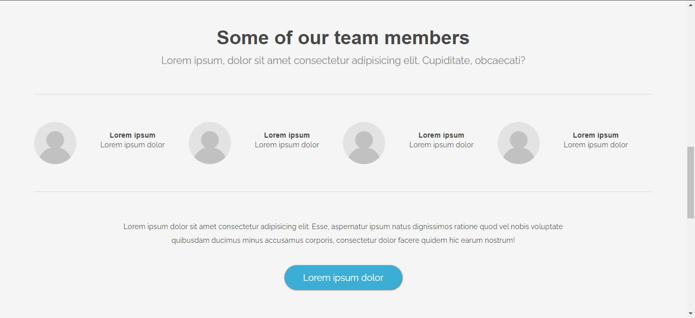

# Transit - Web Page

This is a simple landing page for a fictional transportation company called Transit. The page was created with HTML, CSS, and FontAwesome. It includes a header, main section with three subsections (services, about, and contact), and a footer.

## Getting Started

These instructions will help you get a copy of the project up and running on your local machine for development and testing purposes.

### Prerequisites

A web browser such as Google Chrome, Mozilla Firefox, or Safari.

### Installing

1. Clone or download the project files to your local machine.
2. Open the index.html file in your web browser to view the page.

## Built With

- HTML
- CSS
- FontAwesome

## Authors

- Sadeq yaqoobi - Initial work
- [My Profile](https://github.com/sadeq-yaqobi  'sadeq-yaqobi') 

## Acknowledgments

- [FontAwesome](https://fontawesome.com 'fontawesome.com') - Icons used on the page
- [Unsplash](https://unsplash.com 'unsplash.com') - Image used on the page
- TEMPLATE - Design template used for the page
